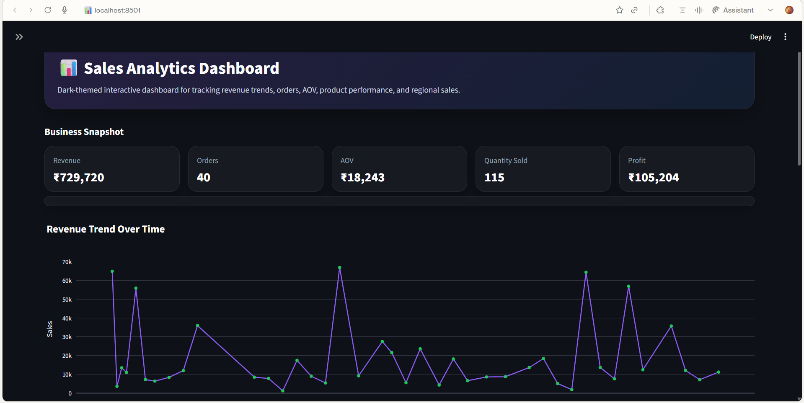
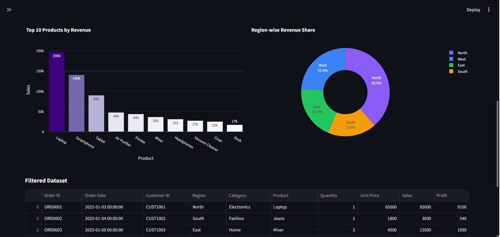
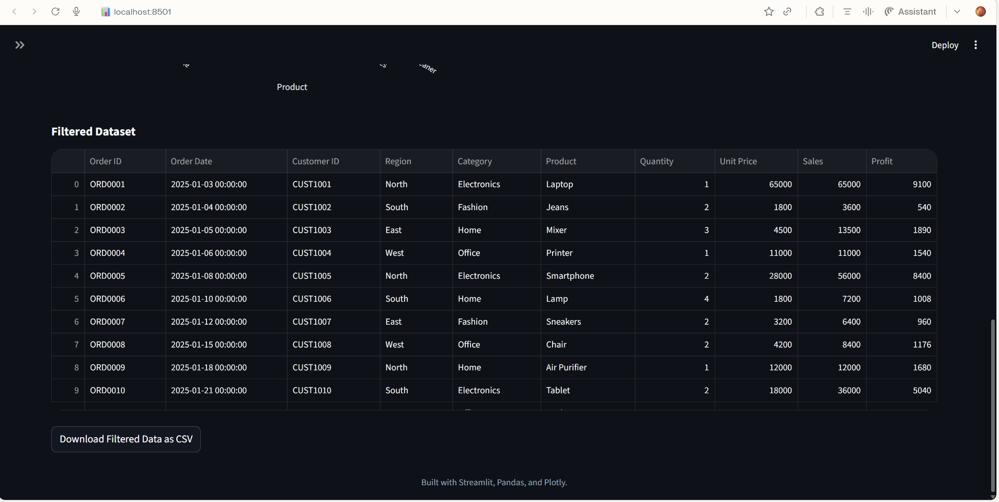
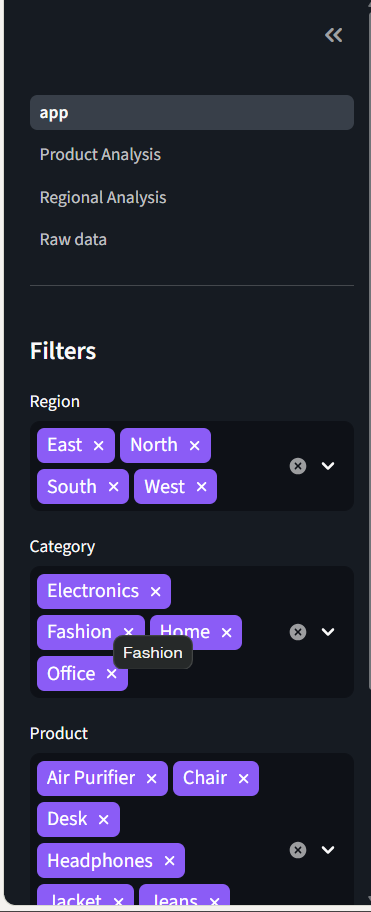
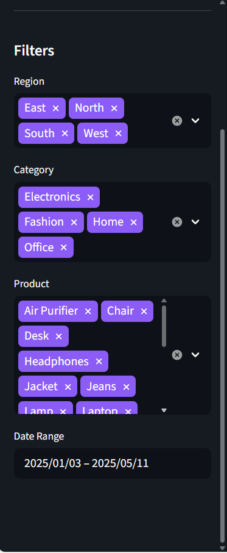

# Sales Analytics Dashboard


A dark-themed interactive sales dashboard built with Streamlit, Pandas, and Plotly to analyze revenue, orders, average order value, product performance, and regional sales trends.[web:211]

---

## Overview

This project presents business insights through an interactive dashboard interface with KPI cards, filters, and visual analytics. It is designed as a portfolio-ready data analytics project that demonstrates dashboard building, data processing, and business reporting skills.[web:206][web:209]

---

## Features

- Dark-themed modern dashboard UI
- KPI cards for Revenue, Orders, Average Order Value, Quantity Sold, and Profit
- Interactive filters for Region, Category, Product, and Date Range
- Revenue trend analysis with Plotly charts
- Product and category performance analysis
- Region-wise sales comparison
- Multipage Streamlit app structure
- Raw data exploration view[web:206][web:210]

---

## Dashboard Screenshots

### Main Dashboard


### Sales Trend View


### Product Analysis


### Regional Analysis


### Raw Data View


---

## Tech Stack

| Tool | Purpose |
|------|---------|
| Python | Core programming language |
| Streamlit | Interactive dashboard framework |
| Pandas | Data cleaning and analysis |
| Plotly | Interactive charts and visualizations |
| OpenPyXL | Excel file support | [web:211]

---

## Project Structure

```text
sales-analytics-dashboard/
│── app.py
│── README.md
│── requirements.txt
│── .streamlit/
│   └── config.toml
│── pages/
│   ├── 1_Product_Analysis.py
│   ├── 2_Regional_Analysis.py
│   └── 3_Raw_Data.py
│── utils/
│   └── helpers.py
│── data/
│   └── sales_data.xlsx
│── screenshots/
│   ├── ss1.png
│   ├── ss2.png
│   ├── ss3.png
│   ├── ss4.png
│   └── ss5.png
```

---

## Dashboard Modules

### 1. Main Dashboard
Displays a high-level overview of business performance using KPI cards and revenue visualizations.

### 2. Product Analysis
Shows product-wise and category-wise sales insights to identify top-performing items.

### 3. Regional Analysis
Compares sales performance across different regions and time periods.

### 4. Raw Data Explorer
Provides a direct view of the dataset for inspection and validation.

---

## Installation

Clone the repository:

```bash
git clone https://github.com/ariti2110/sales-analytics-dashboard.git
cd sales-analytics-dashboard
```

Install dependencies:

```bash
pip install -r requirements.txt
```

Using a `requirements.txt` file is a standard way to recreate the environment for Python apps and deployment workflows.[web:171][web:211]

---

## Run the Application

```bash
streamlit run app.py
```

This is the normal local launch command for a Streamlit application.[web:211]

---

## Use Cases

- Sales performance monitoring
- Revenue trend analysis
- Product-level business insights
- Regional sales tracking
- Portfolio project for data analytics and dashboard development

---

## Future Enhancements

- Add forecasting for future sales trends
- Add customer segmentation analysis
- Enable user-uploaded datasets
- Connect the dashboard to a live database
- Deploy on Streamlit Community Cloud

Streamlit Community Cloud supports deployment workflows that rely on app files and dependency definitions in the GitHub repository.[web:211]

---

## Author

**Ariti**  
Data Science Intern | Aspiring Data Scientist | Software Developer

- GitHub: [ariti2110](https://github.com/ariti2110)
- Repository: [sales-analytics-dashboard](https://github.com/ariti2110/sales-analytics-dashboard)

---

## License

This project is intended for educational and portfolio purposes.